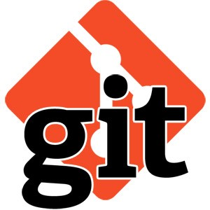
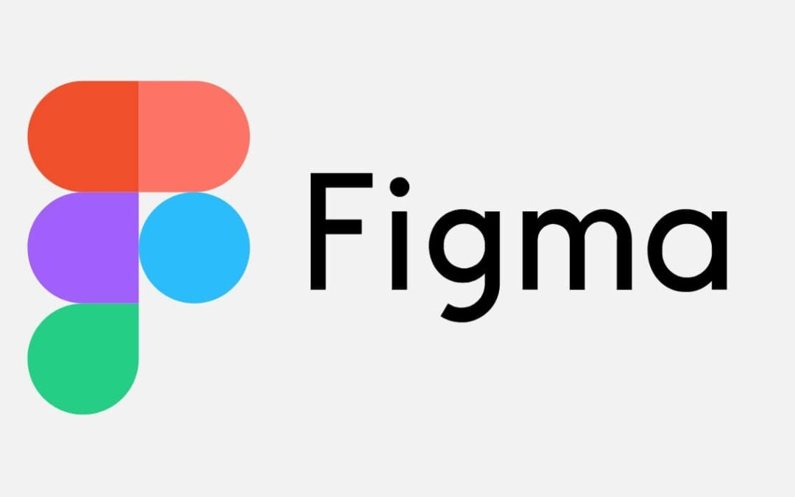
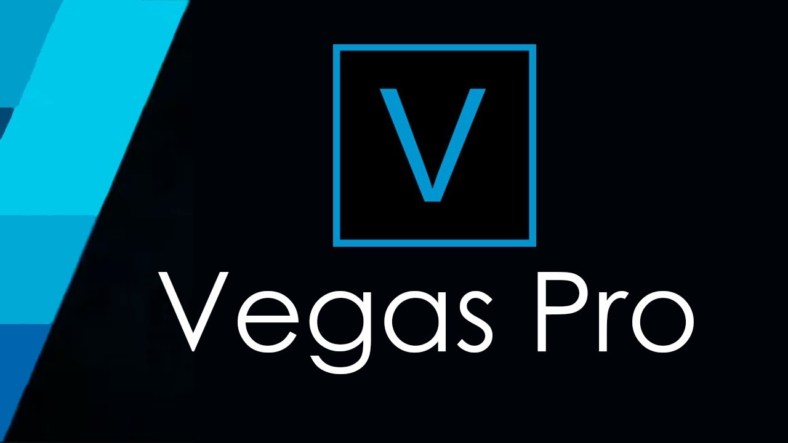
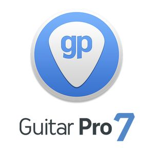

# [Click me & I'll show my resume](https://izmailowalex.github.io/CV/)

# Aleksandr Izmailow

<div>
    
</div>

---
## Contacts:
- Location: Minsk, Belarus
- Phone: +375 29 217 12 40
- E-mail: zippon28@gmail.com
- Telegram: @aleks_bass
- Discord: Alex_zip(@izmailowAlex)

<div>
  <a href="https://www.linkedin.com/in/aleksandr-izmailow/">
    
  </a>
  <a href="https://www.codewars.com/users/rsschool_fedffb7cb5e5775b">
    
  </a>
  <a href="https://github.com/izmailowAlex">
    
  </a>
</div>

---
## About me:

<p>Hello! <br/>
<span>I'm a front-end developer, I create websites, make layout according to the Figma layout, develop games and mobile applications, I also know how to work with REST API databases.
I am interested in programming and I always strive to learn and implement new technologies and approaches in development. I analyze the difficulties that arise as projects are created and look for effective solutions. I flexibly adapt to changes and successfully function in dynamic working conditions. I know how to work in a team and quickly find a common language with all project participants. I am comfortable with constructive criticism and use it to improve my work.</span></p>

---
## Soft skills:

- Ability to analyze problems and find solutions for research
- Ability to plan and organize work to achieve results
- Quickly adapt to job changes
- Willingness to take responsibility for results
- Ability to quickly get along with the team
- How to contact me: [](https://www.linkedin.com/in/aleksandr-izmailow/)

---

## Hard skills :

<div>
  &nbsp;
  &nbsp;
  &nbsp;
  &nbsp;
  &nbsp;
  &nbsp;
  &nbsp;
  &nbsp;
  &nbsp;
  &nbsp;
  &nbsp;
</div>

---

## Code Example:
```javascript
function stairsIn20(a) {
  return 20 * a.reduce((s, a) => s + a.reduce((s, n) => s + n, 0), 0);
}
```
## Education:
* Novopolotsk State Musical College 2001-2005
* Belarusian State Academy of Music 2006-2011
* Programming courses - 
  + [MyITSchool - Frontend web development](https://myitschool.by/)
  + [RSSchool - JavaScript/Front-end developer](https://rs.school/)

---

## Experience:
* 2005 - 2006 -- Gomel Rural House of Culture (artistic director)
* 2010 - 2020 -- Belorussian State Philarmony (ensemble artist)
* 2020 - 2023 -- Exemplary Orchestra of the Internal Troops (orchestra artist)
* 2023 - until now -- Hotel "Rixos Bab al Bahr 5*" (Dubai, Ras-al-Khaima) (coverband musician)

---

## Engrish:
**B1** (studying at the school of foreign languages "Streamline")
## Russian:
**native**
## Belorussian:
**native**